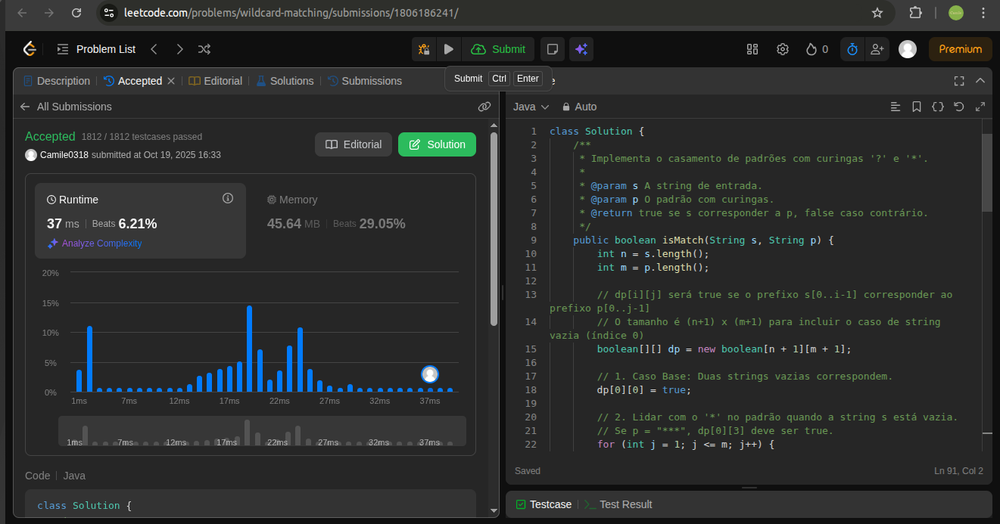
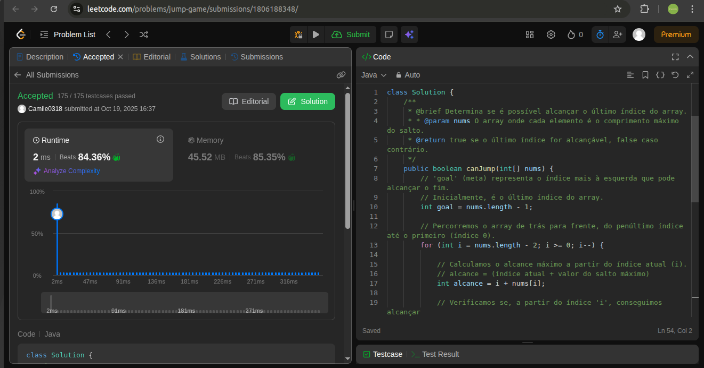

# Greedy_LeetCode_D8

Repositório da Dupla 08 do semeste 2025.2.

**Conteúdo:** Algoritmos ambiciosos
## Alunos

| Matrícula | Aluno |
|-----------|-------|
| 25/1035022 | Camile Barbosa Gonzaga De Oliveira |
| 22/1008294 | Luiza Maluf Amorim |

## Objetivo

Desenvolver questões em que possamos explorar nossos conhecimentos desenvolvidos em sala de aula sobre o assunto Algoritmos Gulosos (Greedy Algorithms).

## Instalação

- **Linguagem**: Python e C.

## Exercícios

|Código do Problema| Nome do Problema | Resolução | Dificuldade
|----------|----------|----------|----------|
|44|[Wildcard Matching](https://leetcode.com/problems/wildcard-matching)|[44](./assets/44.png)|Difícil|
|55|[Jump Game](https://leetcode.com/problems/jump-game)|[55](./assets/55.png)|Média|
|316| [Remove Duplicate Letters](https://leetcode.com/problems/remove-duplicate-letters/submissions/1795909861/?envType=problem-list-v2&envId=greedy)|[316](assets/316.png)|Média|
|1330|[Reverse Subarray To Maximize Array Value](https://leetcode.com/problems/reverse-subarray-to-maximize-array-value/description/?envType=problem-list-v2&envId=greedy)|[1330](./assets/1330.png)|Difícil|


## Apresentação

[Link para a apresentação](https://www.youtube.com/watch?v=rSvjtLfVsZM)

## Screenshots

### 44

<center>



</center>

### 55

<center>



</center>

### 316

<center>


</center>

### 1330
<center>


</center>


## Pré-requisitos

### PythonGrafos2_LeetCode_D8
- Ter o [Python 3](https://www.python.org/downloads/) instalado na máquina.  
- (Opcional) Criar e ativar um ambiente virtual:
  ```bash
  python3 -m venv venv
  source venv/bin/activate   # Linux/Mac
  venv\Scripts\activate      # Windows
  ```

### C
- Ter um compilador C instalado . O GCC (GNU Compiler Collection) é o mais utilizado e ele já vem pré-instalado em muitos sistemas operacionais (como Linux e macOS).
- Se você estiver no Windows e precisar instalar o GCC, pode considerar o uso do MinGW ou do Cygwin.

- (Opcional) Acessar um compilador C online para escrever, compilar e executar o código diretamente no navegador.

## Como rodar

### Python 

Para executar uma solução específica:

 ```bash
 python nome_do_arquivo.py
 ```

### C

 ```bash
gcc nome_do_arquivo.c
./a.out 
 ```
